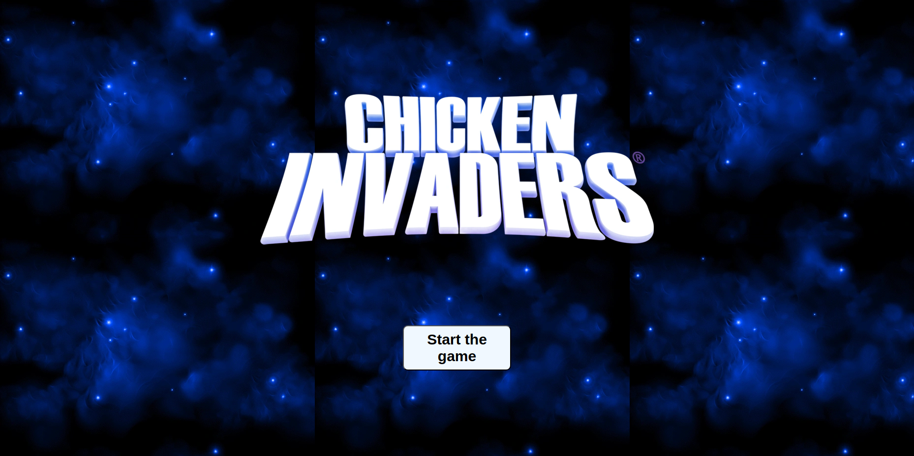
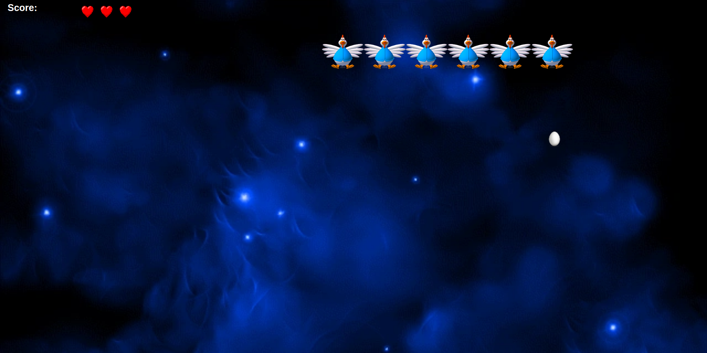
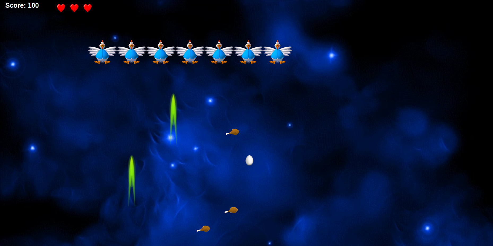

# chicken Invaders

## Date: 04/30/2024

### By: Jasim Salman

[LinkedIn](https://bh.linkedin.com/in/jasim-salman-0b885b219) | [Github](https://github.com/jasimSalman)

---

### _***Description***_

Chicken Invaders is a game where chickens try to invade the earth while there is a spaceship that tries to defeat them. The players control the spaceship and shoot the chicken while at the same time trying to avoid the chicken attack.

### _***Technologies Used***_

- HTML
- CSS
- JavaScript

### _***Getting Started***_

To start the game just hit on the start button, which will take you to the game page. Your mission is to eliminate all the chickens to bypass each level. They will try to destroy your spaceship by eggs attack so try to avoid it. Remember, avoid crashing the chickens with your spaceship because it will explode.

### _***Screenshots***_

##### Main page

##### Game page

### **_Future Updates_**

- [ ] Add final boss
- [ ] Add score board

### **_Creadits_**

#### [w3Schools](https://www.w3schools.com/jsref/met_element_getboundingclientrect.asp)

#### [Medium](https://github.com/jasimSalman/u1_hw_markdown)
